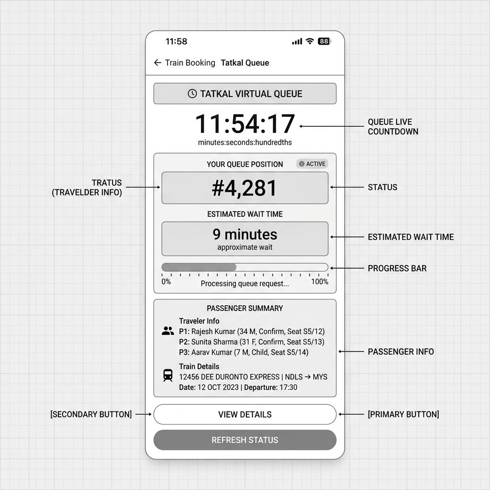
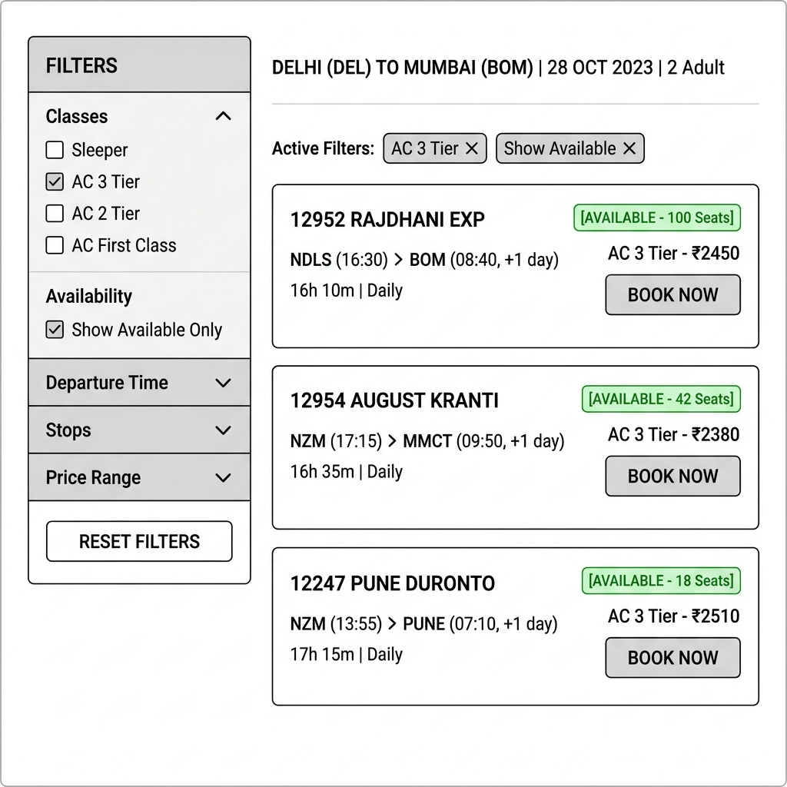
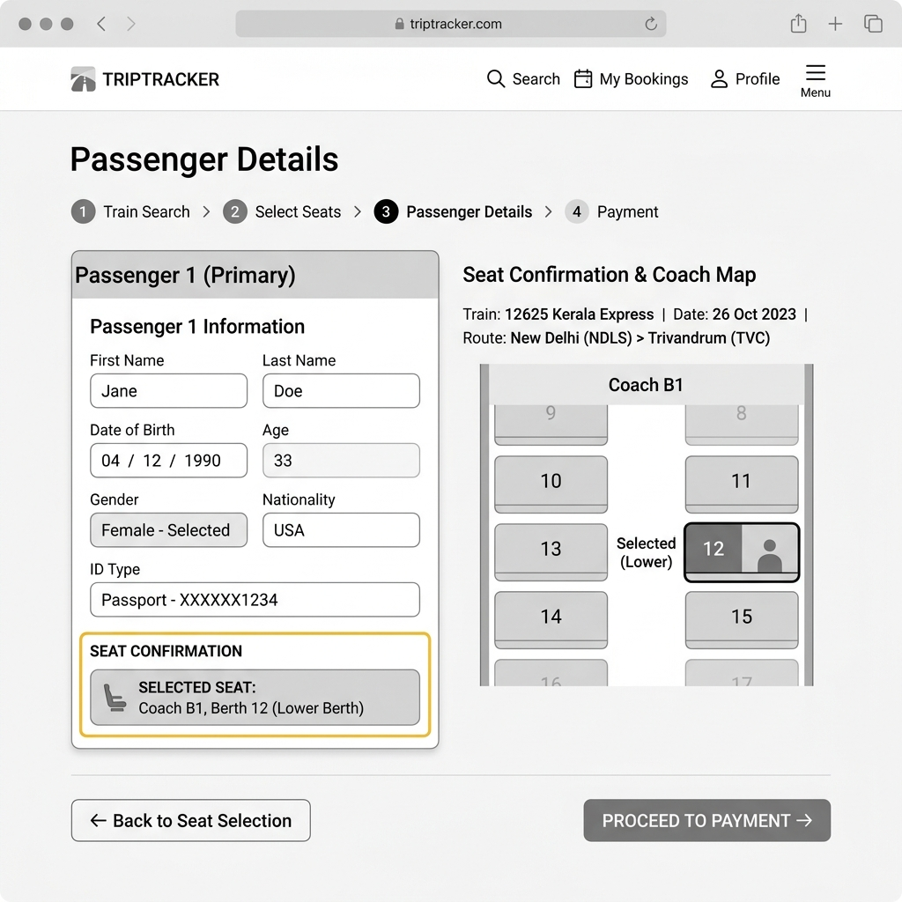
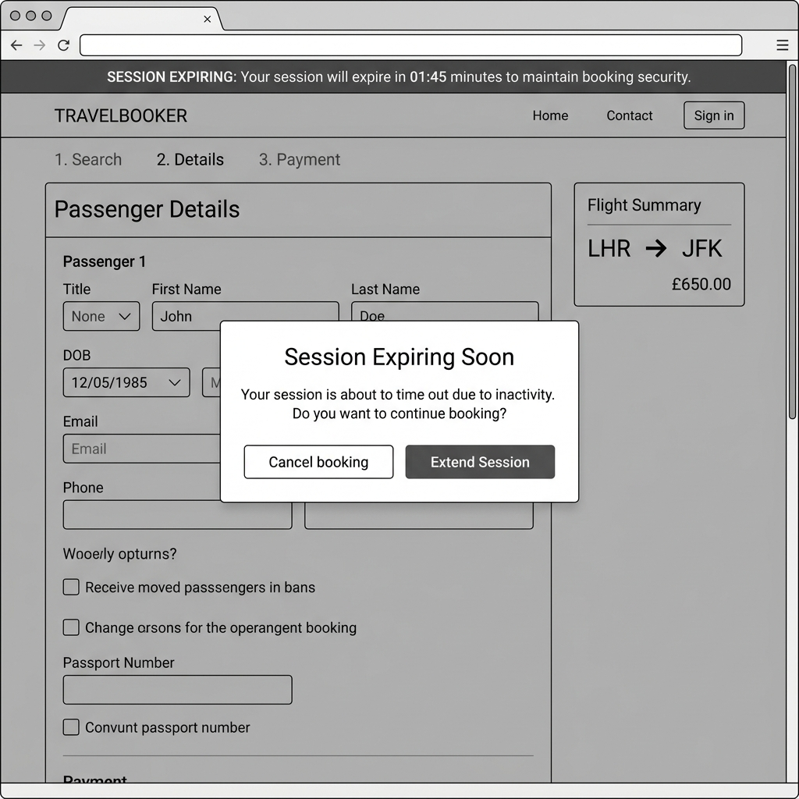
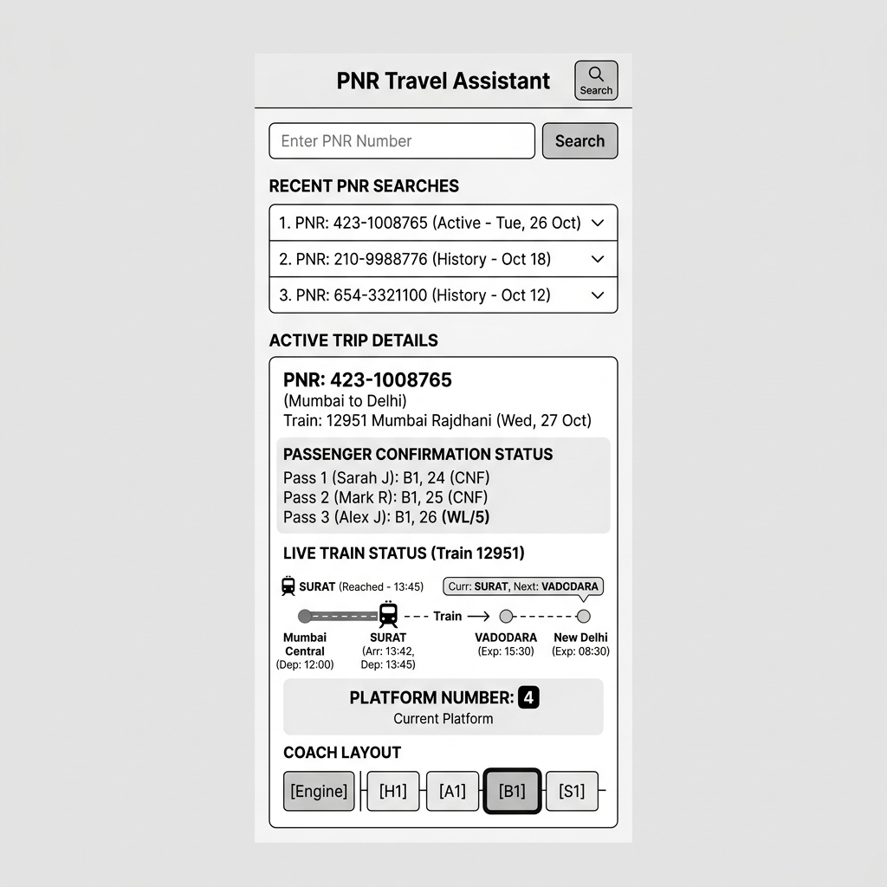
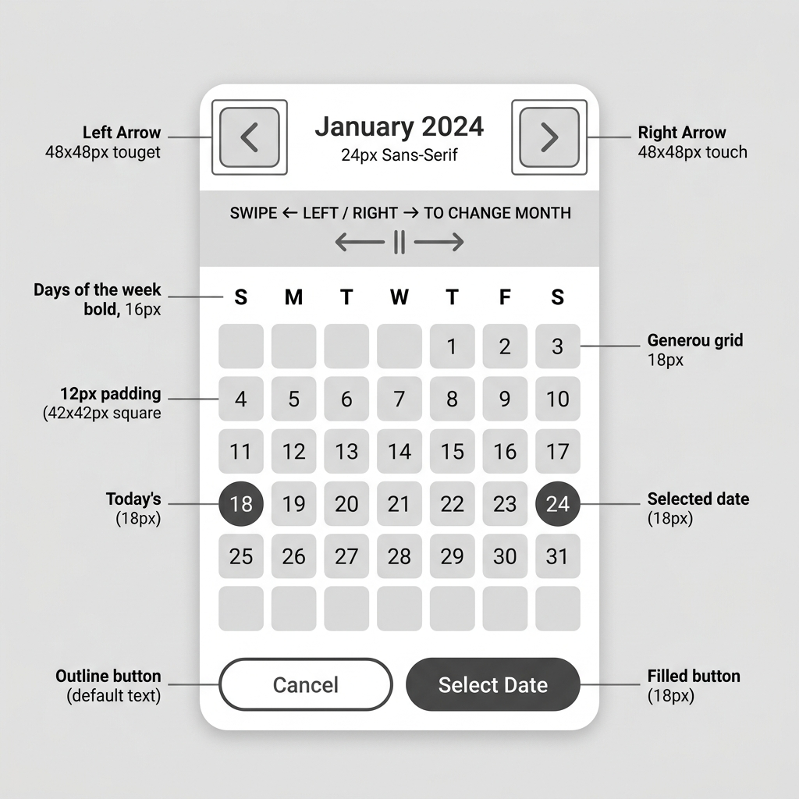

# Feature Specifications (Part B)

This document contains the product and engineering feature specifications to address the six critical IRCTC problems audited in Part A. Each specification is written from the perspective of a design engineer, detailing the problem statement, current state, proposed user flow, technical architecture changes, success metrics, edge cases, and mid-fidelity wireframes.

---

## Feature Spec 1: Tatkal Booking Virtual Waiting Queue

### Problem Statement
The IRCTC platform crashes or becomes unresponsive during the daily peak Tatkal booking windows (10:00 AM for AC and 11:00 AM for non-AC) due to massive concurrent write requests on the booking APIs. Millions of users experience screen freezes, unhandled 502 Bad Gateway errors, delayed OTPs, and sudden logouts, forcing them to miss their travel bookings entirely.

### Current State (from Part A)
Refer to [PROBLEMS.md (Problem 1)](file:///c:/Projects/bootcamp_1/part-a/PROBLEMS.md#given-problem-1-tatkal-booking-crashes-at-1000-am). The flow breaks at Steps 4–6 when clicking "Book Now" at 10:00:00 AM triggers a server-side lock, resulting in zero user feedback, loading spinner freezes, and unhandled session disconnects.

### Proposed Solution
We will implement a stateless **Virtual Waiting Queue** using a token-bucket rate limiter and an asynchronous task runner. Instead of sending all concurrent checkout requests directly to the main booking database at once, users will be placed in a virtual waiting room upon clicking "Book Now". 
The UI will display their real-time queue position, progress percentage, and estimated wait time. When a slot is available, their queue token will expire in 90 seconds, giving them a dedicated window to finalize their payment securely.

### Proposed User Flow — Step by Step
1. User logs in, searches for a train, and selects the Tatkal quota.
2. User fills in passenger details (pre-filled from Master List) and clicks "Review Journey" at 9:59:00 AM.
3. At 10:00:00 AM, the user clicks "Book Now".
4. Instead of freezing, the system redirects the user to the **Queue Screen** showing a live countdown timer, their exact queue position (e.g., `#4,281`), and an estimated wait time (e.g., `~3 minutes`).
5. A live progress bar updates smoothly on screen. Users can cancel and leave the queue if they wish.
6. When the user's queue token is called, a buzzer notification sounds, and the screen transitions to the payment page.
7. A 90-second countdown timer starts. The user completes payment using their preferred method (e.g., UPI or Credit Card).
8. The payment is processed, and the confirmed ticket is displayed.

### Technical Implementation Plan
**System components affected:**
*   **Frontend Web App:** Queue screen component, WebSocket client, state management.
*   **Backend API Gateway:** Route checking, rate-limiting filter, JWT token signer.
*   **Queue Service (Redis/BullMQ):** Redis sorted sets (`ZSET`) to manage queue ordering and priority.
*   **Booking Worker Pool:** Asynchronous ticket processors matching booking tickets to the backend CRIS reservation database.

**New data requirements:**
*   `queue_token`: String (UUID)
*   `queue_position`: Integer
*   `queue_joined_at`: Timestamp
*   `queue_status`: Enum (`WAITING`, `ACTIVE`, `EXPIRED`, `COMPLETED`)
*   `token_expiration_time`: Timestamp (current time + 90 seconds for active tokens)

**API changes:**
*   `POST /api/v1/booking/queue/join`
    *   *Request:* `{ train_id: "12622", class: "SL", passengers: [...] }`
    *   *Response:* `{ success: true, queue_token: "qt_987654", initial_position: 4281, est_wait_seconds: 180 }`
*   `GET /api/v1/booking/queue/status`
    *   *Request Header:* `Authorization: Bearer qt_987654`
    *   *Response:* `{ queue_status: "WAITING", current_position: 1240, est_wait_seconds: 45 }` (or `"ACTIVE"` when ready)
*   `POST /api/v1/booking/checkout`
    *   *Request Header:* `Authorization: Bearer qt_987654`
    *   *Request:* `{ payment_details: {...} }`
    *   *Response:* `{ success: true, pnr: "1234567890" }`

**Frontend changes:**
*   Add a new route `/booking/waiting-room`.
*   Implement a WebSocket connection or long-polling fallback to monitor `/api/v1/booking/queue/status`.
*   Build a responsive waiting room UI with a progress bar and countdown indicator.

**Third-party services (if any):**
*   **Redis Enterprise:** For managing high-throughput waiting queue states.

### Success Metrics
*   Tatkal booking API response rate (HTTP 200) increases from 45% to 99.9%.
*   Server error rates (502 / 504 Gateway Timeouts) during peak hours drop to 0%.
*   User checkout flow completion rate increases from 40% to 75%.

### Edge Cases and Constraints
*   **Edge Case: Internet disconnection while in queue.**
    *   *Resolution:* The queue token is persisted in Redis. If the user reconnects within 2 minutes of disconnection, their position is restored.
*   **Constraint: Booking seats sell out while in queue.**
    *   *Resolution:* The queue system tracks real-time inventory. If the remaining seats drop to 0, the waiting room displays "Seats Sold Out" and gives the user the option to join the general Waitlist (WL) or leave the queue.
*   **Graceful Degradation:** If the Redis queue cluster crashes, the gateway falls back to a rate-limiting choke, routing requests in small batches directly to the main reservation system.

### Wireframe

*Caption: Proposed Tatkal virtual queue screen — mobile view*

---

## Feature Spec 2: Persistent & Client-Synced Search Filters

### Problem Statement
The search filters on the IRCTC train search results page do not accurately apply criteria like class availability and quotas. Waitlisted trains appear in filtered results, and the filter state is completely wiped from memory whenever the user navigates back from a train details page, forcing them to re-apply filters from scratch.

### Current State (from Part A)
Refer to [PROBLEMS.md (Problem 2)](file:///c:/Projects/bootcamp_1/part-a/PROBLEMS.md#given-problem-2-search-filters-do-not-work-reliably). The flow breaks at Steps 4–6 when applying the filters displays waitlisted trains instead of only available ones, and back-navigation wipes the filter configurations entirely.

### Proposed Solution
We will implement client-side filter state preservation using browser memory (React Router state or local session storage) combined with a dual-stage filtering engine. Checking a filter (e.g., "Available Only") will immediately hide non-matching items from the client view and trigger a background fetch to verify live availability. When the user clicks "Back", the exact state of all checkboxes, inputs, and sort toggles will be reloaded from session state.

### Proposed User Flow — Step by Step
1. User enters search details and is presented with a listing of 30 trains.
2. User opens the filter sidebar and checks "Sleeper Class (SL)" and "Show Available Only".
3. The list updates instantly, hiding all trains that do not support SL class or have a waitlist status.
4. User clicks on a filtered train card to review details and check live availability.
5. User decides to view other options and clicks the "Back to Search Results" button.
6. The page loads with the "Sleeper Class" and "Show Available Only" checkboxes checked.
7. The search results list displays the same filtered subset of trains, keeping the scroll position intact.

### Technical Implementation Plan
**System components affected:**
*   **Frontend Search Component:** Filter sidebar, state provider, URL query parameters parser.
*   **Session Storage Manager:** Local cache wrapper to read/write filter states.

**New data requirements:**
*   `search_filter_state`: JSON Object containing:
    ```json
    {
      "classes": ["SL", "3A"],
      "available_only": true,
      "departure_window": "morning",
      "sort_by": "duration",
      "scroll_position": 420
    }
    ```

**API changes:**
No new APIs are needed. The existing search endpoint `GET /api/v1/trains/search` will support filtering parameters as optional query strings so that filtered URLs can be shared or bookmarked directly:
*   `GET /api/v1/trains/search?from=MAS&to=NDLS&date=2026-06-10&classes=SL,3A&available_only=true`

**Frontend changes:**
*   Refactor the filter component to store its state in the URL query string (`react-router` search params).
*   Add a page lifecycle event listener to write current filters and window scroll coordinates to `sessionStorage` before unmounting.
*   On component mount, read from `sessionStorage` or URL parameters to restore filter selections and scroll height.

### Success Metrics
*   Average time spent finding a suitable train drops by 45% (from 12 minutes to under 7 minutes).
*   Filter-related user backtrack rate drops from 80% to less than 5%.
*   Zero incidents of waitlisted trains appearing when "Available Only" is checked.

### Edge Cases and Constraints
*   **Edge Case: The user changes search dates or stations.**
    *   *Resolution:* The app detects a mismatch between current search criteria and the cached `sessionStorage` criteria, automatically clearing the filter cache to prevent irrelevant filters from applying to a new search.
*   **Constraint: Mobile screen space.**
    *   *Resolution:* On mobile views, the filter sidebar collapses into a sticky floating "Filter (2)" button at the bottom of the screen.

### Wireframe

*Caption: Proposed persistent train search filters — desktop view*

---

## Feature Spec 3: Seat Selection State Retention

### Problem Statement
During train bookings, the user's specific seat/berth choices selected from the coach layout map do not persist when moving to the passenger details page. The system silently overrides selected lower berths with "Auto-Assign" or incorrect seat choices, which splits family groups and senior citizens across different compartments.

### Current State (from Part A)
Refer to [PROBLEMS.md (Problem 3)](file:///c:/Projects/bootcamp_1/part-a/PROBLEMS.md#given-problem-3-seat-selection-resets-randomly). The flow breaks at Steps 3–5 when the selected seat highlights in blue on the map, but is replaced by "Auto" on the next details form. Tapping back reveals that the chosen seat has become locked or taken.

### Proposed Solution
We will implement a client-server seat reservation system. Selecting a seat in the seat map will trigger a temporary 10-minute lease on that seat in the database. The frontend state manager will store this lease ID and pass it as a parameter when navigating to the passenger details form. The passenger form fields will display a read-only confirmation box showing their locked seat.

### Proposed User Flow — Step by Step
1. User selects a train and launches the Coach Seat Map.
2. User clicks Lower Berth `Coach B1, Seat 12` for passenger 1.
3. A success message appears: "Seat 12 locked for 10:00 minutes."
4. User clicks "Proceed". The passenger form loads.
5. In the Passenger Details section, the form displays: "Passenger 1: Assigned to Coach B1, Seat 12 (Lower)" with a green locked icon.
6. The user fills in the passenger details.
7. User proceeds to checkout. The payment summary displays the exact coach and seat number.
8. Upon payment confirmation, the ticket is generated with the selected seat.

### Technical Implementation Plan
**System components affected:**
*   **Seat Map Component:** Click event handling, countdown timer.
*   **Passenger Details Form:** Form state validation.
*   **Backend Inventory Service:** Temporary seat lease cache (Redis TTL keys).

**New data requirements:**
*   `seat_lease_id`: String (UUID)
*   `lease_expiry`: Timestamp
*   `passenger_berth_association`: `{ passenger_index: 0, coach: "B1", seat_no: 12, preference: "LB" }`

**API changes:**
*   `POST /api/v1/inventory/seat/lock`
    *   *Request:* `{ train_id: "12622", date: "2026-06-10", coach: "B1", seat_no: 12 }`
    *   *Response:* `{ success: true, lease_id: "lease_xyz789", expires_in_seconds: 600 }`
*   `POST /api/v1/inventory/seat/unlock`
    *   *Request:* `{ lease_id: "lease_xyz789" }`
    *   *Response:* `{ success: true }`

**Frontend changes:**
*   Add a local timer component to show the remaining lease time on the booking layout.
*   Disable edit capability of seat preferences on the passenger form once a seat map selection is active, forcing the user to use the map to modify choices.

**Third-party services (if any):**
None. Uses existing Redis instance for managing TTL locks.

### Success Metrics
*   Discrepancies between selected seats and booked seats drop from 25% to 0%.
*   Negative reviews regarding split seating for families reduce by 90%.
*   Booking completion rate for elderly passengers requiring lower berths increases by 30%.

### Edge Cases and Constraints
*   **Edge Case: User leaves the form page or closes the tab.**
    *   *Resolution:* The Redis key has a 10-minute TTL. Once the timer expires, the database automatically unlocks the seat, making it available to other users.
*   **Constraint: High seat-locking concurrency during Tatkal.**
    *   *Resolution:* Direct seat map selection is disabled during the first 30 minutes of Tatkal windows to protect system stability, defaulting to auto-assignment during high-load periods.

### Wireframe

*Caption: Proposed seat selection confirmation layout — passenger form view*

---

## Feature Spec 4: Silent Session Timeout Warning & Extension

### Problem Statement
The IRCTC website terminates sessions after a short period (3–5 minutes) of inactivity without providing any countdown timer or alert warning. Users typing passenger names, looking up ID card numbers, or waiting for payment OTPs lose their entire form data, forcing them to start the booking journey again from the home page.

### Current State (from Part A)
Refer to [PROBLEMS.md (Problem 4)](file:///c:/Projects/bootcamp_1/part-a/PROBLEMS.md#problem-4-aggressive-silent-session-timeout-without-warning-or-state-preservation). The flow breaks at Steps 5–7 when the user spends over 3 minutes retrieving co-traveler Aadhaar cards, resulting in a silent timeout and redirection to the login screen upon form submission.

### Proposed Solution
We will introduce a client-side session monitor linked to the user's login expiry. A persistent session countdown bar will be added to the website header. When the session has 2 minutes remaining, a prominent modal overlay will appear: "Session Expiring Soon". The user can click an "Extend Session" button, which triggers a minor handshake API call to reset the backend token timer, keeping their form data intact.

### Proposed User Flow — Step by Step
1. User logs in and begins filling out passenger details.
2. In the header, a subtle text label shows: "Session Time: 05:00" and ticks down.
3. The user stops typing to look up an Aadhaar card on their phone.
4. At "02:00" remaining, a modal dialog dims the background screen.
5. The modal displays: "Session Expiring: Your session will expire in 2 minutes due to inactivity. Would you like to extend it?" with a live countdown.
6. The user clicks "Extend Session".
7. The modal closes, the session timer resets back to "05:00", and the user continues entering data without losing any inputs.
8. If the user does not respond and the countdown hits zero, the page displays: "Session Expired. Copying entered details to clipboard for recovery." before redirecting.

### Technical Implementation Plan
**System components affected:**
*   **Frontend Layout:** Global navigation bar, Modal overlay component.
*   **Session Handler:** Redux/Context state monitoring user keystrokes and API requests.
*   **Backend Auth API:** Session renewal endpoint.

**New data requirements:**
*   `session_expires_at`: Timestamp
*   `last_active_at`: Timestamp

**API changes:**
*   `POST /api/v1/auth/session/extend`
    *   *Request:* `{ current_token: "jwt_abc123" }`
    *   *Response:* `{ success: true, token: "jwt_new456", new_expiry: "2026-06-05T10:20:00Z" }`

**Frontend changes:**
*   Implement a React hook `useSessionTimer` that triggers a browser timeout.
*   The timer is reset on any user input (typing, clicking) inside form inputs.
*   If no inputs occur, show the modal at `expiry - 120` seconds.

### Success Metrics
*   Logouts due to inactivity timeouts during checkout drop by 80%.
*   Form re-submission rate drops from 30% to under 5%.
*   User complaints regarding "Session Expired" errors decrease by 85%.

### Edge Cases and Constraints
*   **Edge Case: User is waiting for a bank 3D-secure OTP.**
    *   *Resolution:* The checkout page runs on a separate session policy that auto-extends the session up to 10 minutes when the active tab is redirected to a bank domain, preventing payment drop-offs.
*   **Constraint: Security policies on public computers.**
    *   *Resolution:* The session can only be extended 3 times max before requiring a re-authentication CAPTCHA to prevent unauthorized users from hijacking sessions on public kiosks.

### Wireframe

*Caption: Proposed session timeout alert and modal warning — desktop view*

---

## Feature Spec 5: Consolidated PNR Travel Assistant

### Problem Statement
The PNR Status page requires users to manually re-enter their 10-digit PNR and solve a CAPTCHA on every check. The results page is static, displaying raw confirmation codes while omitting real-time journey details like live location, arrival platform, and coach guidance, forcing users to utilize third-party websites.

### Current State (from Part A)
Refer to [PROBLEMS.md (Problem 5)](file:///c:/Projects/bootcamp_1/part-a/PROBLEMS.md#problem-5-incomplete-unsaved-pnr-status-journey-information). The flow breaks at Steps 5–7 when the user gets static status output, prompting them to close the tab to look up platform and delay info on third-party sites, and requires manual PNR entry next time.

### Proposed Solution
We will transform the static PNR page into a **Consolidated PNR Travel Assistant**. The client will store the history of the last 5 queried PNRs in local storage, allowing one-click updates without CAPTCHAs for logged-in sessions. The PNR status view will load a dynamic dashboard aggregating live running location (from NTES API), scheduled arrival platform number, and an interactive coach map indicating exactly where the passenger's coach will halt on the platform.

### Proposed User Flow — Step by Step
1. User navigates to the PNR Status section.
2. The page displays a "Recent Searches" card listing the passenger's active PNR numbers.
3. User clicks on their active PNR in the list.
4. The dashboard loads instantly, displaying passenger ticket confirmation status.
5. Below the status, a live map widget shows the train's current position (e.g., "Arriving at MAS in 15 mins. Delayed by 10m").
6. A large badge displays: "Expected Platform: 4" (updated in real-time).
7. A visual coach layout map displays the train coach sequence, highlighting the user's coach (e.g., `B1`) in green relative to the platform entrance, helping them position themselves before arrival.

### Technical Implementation Plan
**System components affected:**
*   **PNR Frontend Dashboard:** History widget, live map component, coach guide component.
*   **NTES API Wrapper:** Backend microservice caching train running data.
*   **Local Storage Sync:** Client-side utility for saving query history.

**New data requirements:**
*   `pnr_search_history`: Array of string PNRs saved in client browser `localStorage`.
*   `live_train_status`: JSON response containing current station, delay, and platform.

**API changes:**
*   `GET /api/v1/pnr/status?pnr_no=1234567890`
    *   *Request:* PNR string.
    *   *Response:*
        ```json
        {
          "pnr": "1234567890",
          "passengers": [{ "no": 1, "status": "CNF", "coach": "B1", "berth": 12 }],
          "live_details": {
            "current_station": "MAS",
            "delay_minutes": 10,
            "platform": "4",
            "coach_sequence": ["ENG", "GEN", "S1", "S2", "B1", "B2", "A1"]
          }
        }
        ```

**Frontend changes:**
*   Implement a local storage manager to save the last 5 checked PNRs.
*   Build responsive SVG-based train coach visualization components.
*   Integrate a maps component for tracking train running coordinates.

**Third-party services (if any):**
*   **National Train Inquiry System (NTES) API:** To fetch live platform and GPS train status.

### Success Metrics
*   Daily visits to third-party train tracking apps by IRCTC users drop by 60%.
*   Repeat PNR entries on the official website reduce from 100% manual to 15% manual (85% loaded from history).
*   User satisfaction score for PNR dashboard increases to 4.8/5.0.

### Edge Cases and Constraints
*   **Edge Case: Platform number changes at the last minute.**
    *   *Resolution:* The dashboard implements a SSE (Server-Sent Events) live feed that pushes instant platform change alerts to the active screen.
*   **Constraint: Offline use.**
    *   *Resolution:* The last successfully loaded journey details are cached locally in PNR assistant so the user can access their coach position at the station even on poor mobile network connections.

### Wireframe

*Caption: Proposed PNR Travel Assistant dashboard — mobile view*

---

## Feature Spec 6: Accessibility-Focused Mobile Date Picker

### Problem Statement
On mobile web browsers, the calendar date picker overlaps screen layouts, and month navigation controls are too small (under 18px), violating accessibility tap targets. This results in misclicked dates, unintended calendar closures, and users booking tickets for incorrect months.

### Current State (from Part A)
Refer to [PROBLEMS.md (Problem 6)](file:///c:/Projects/bootcamp_1/part-a/PROBLEMS.md#problem-6-mobile-web-date-picker-layout-and-touch-target-violations). The flow breaks at Steps 4–7 when the user attempts to tap the tiny month arrow and misclicks the date beneath it, closing the calendar and forcing a search reset.

### Proposed Solution
We will redesign the mobile web date picker into a full-screen bottom sheet widget designed for touch. The month navigation arrows will be replaced with large 48px chevron buttons. The calendar will support standard swipe gestures (swipe left/right to change months). Individual date targets will have a minimum bounding height of 48px, with ample padding, ensuring misclicks are eliminated.

### Proposed User Flow — Step by Step
1. User taps the "Journey Date" input field on their mobile web browser.
2. A full-screen bottom sheet slides up, dimming the background search form.
3. The calendar displays the current month with large, clear numbers.
4. Top navigation chevrons for changing months are styled as large 48px square buttons.
5. User swipes left on the screen to smoothly slide to the next month.
6. User taps a date; the selected day highlights in blue, and a bottom bar confirms: "Sunday, June 10, 2026".
7. User taps the large "Select Date" button at the bottom.
8. The sheet slides down, and the date is filled correctly on the search form.

### Technical Implementation Plan
**System components affected:**
*   **Mobile UI components library:** Date picker widget.
*   **Gesture Manager:** Touch event handlers (swipe tracking).

**New data requirements:**
No new data fields required. Uses existing javascript date formats.

**API changes:**
None. All changes are entirely frontend-oriented.

**Frontend changes:**
*   Create a mobile-specific React date component triggered by screen-width media queries.
*   Integrate a swipe gesture library (like `react-swipeable` or implement raw touch event handlers).
*   Apply CSS touch-action rules to prevent double-tap zooming on the widget.

### Success Metrics
*   Miscalculated date booking cancellations drop by 90% for mobile web users.
*   Time taken to input journey dates decreases from 45 seconds to 5 seconds.
*   Accessibility compliance score for the date input flow reaches WCAG 2.1 AA level.

### Edge Cases and Constraints
*   **Edge Case: Older mobile browsers that do not support swipe gesture events.**
    *   *Resolution:* The chevron buttons remain visible as a robust fallback navigation mechanism.
*   **Constraint: Landscape screen layout on mobile.**
    *   *Resolution:* If the phone is rotated to landscape, the date picker collapses into a scrollable, single-line date horizontal list.

### Wireframe

*Caption: Proposed accessible mobile date picker — mobile bottom sheet view*

---
